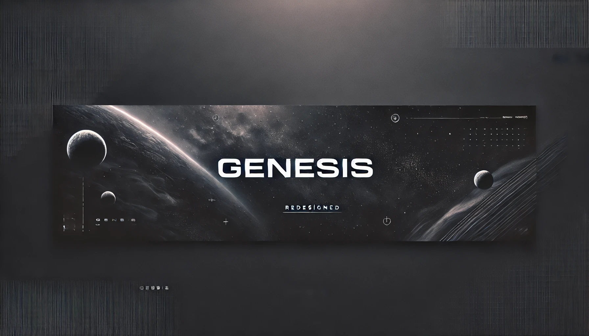
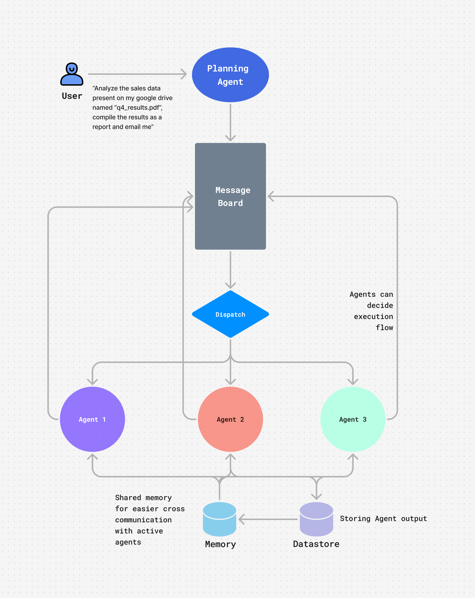

# Genesis-GPT


---
## 🌟 Introducing Genesis: A Multi-Agent System for Seamless Collaboration 🌟

Genesis is an ambitious project aimed at creating a robust multi-agent system designed for seamless collaboration, leveraging cutting-edge technologies and architectures. Originally inspired by graph-based systems like LangGraph, Genesis overcomes the limitations of tight agent coupling by enabling free-flowing communication and focused collaboration when required.

---

## Overview

Genesis represents a significant step forward in the field of autonomous agents. With its innovative hybrid coupling architecture, message board system, and modular agent templates, Genesis simplifies multi-agent orchestration and makes building and integrating agents easier than ever.

---

## What Makes Genesis Unique?

### **Hybrid Coupling**
- **Loose Coupling**: Agents collaborate freely in open-ended tasks, enabling dynamic interaction.
- **Tight Coupling**: Ensures precise execution for targeted tasks, allowing focused collaboration.

### **Message Board Architecture**
- Acts as the central hub for task assignment and communication.
- Facilitates seamless coordination and decision-making among agents.

### **Agent Template**
- Plug-and-play support for LangChain, LlamaIndex, or custom agents.
- Features include:
  - Automated prompt handling.
  - Agent history and artifact saving.
  - Observability tools (track token usage, decisions, and cycles).

### Architecture:



---

## Getting Started

Follow these steps to get started with Genesis:

### Step 1: Clone the Repository
1. Open a terminal on your computer.
2. Clone the repository using the following command:
   ```bash
   git clone https://github.com/your-username/Genesis.git
   ```
3. Navigate to the project directory:
   ```bash
   cd Genesis
   ```

### Step 2: Download the Repository (Optional)
If you prefer not to use Git, you can download the repository directly:
1. Click the **Code** button at the top-right corner of this repository.
2. Select **Download ZIP**.
3. Extract the downloaded ZIP file to a folder on your computer.

### Step 3: Install Dependencies
- Detailed instructions for installing dependencies will be added as the project progresses.

### Step 4: Run the Application
- Usage instructions will be provided as the project evolves.

---

## Contributing

We welcome contributions to Genesis. To contribute, follow these steps:

1. Fork the repository.
2. Create a new branch for your feature or bug fix:
   ```bash
   git checkout -b feature-name
   ```
3. Make your changes and commit them:
   ```bash
   git commit -m "Add a meaningful commit message"
   ```
4. Push your branch to your forked repository:
   ```bash
   git push origin feature-name
   ```
5. Submit a pull request.

---

## Why Genesis?

Genesis simplifies multi-agent orchestration by abstracting complexities, making it easier to build and integrate agents. Whether for loose or tight coupling, its architecture ensures flexibility and reliability, making it a powerful tool for developers tackling complex systems.

###### License

will be updated as the project progresses.

---

Thank you for your interest in Genesis-GPT! We look forward to pushing the boundaries of autonomous agents with your support.
